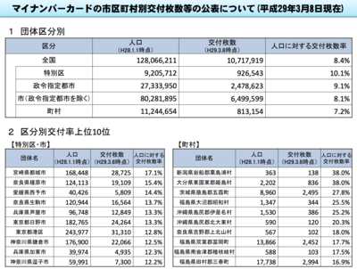
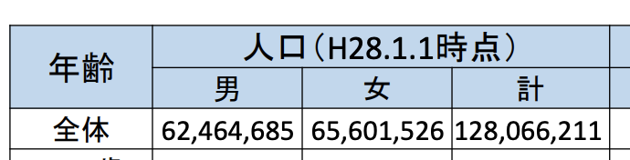

この解説記事では、総務省の公開する PDF ファイルを CSV ファイルに変換し、データとして活用しやすい形に変えるまでの過程を紹介します。

## はじめに：なぜ PDF ではいけないのか

このサイトでは、総務省が[「マイナンバーカード交付状況について」](https://www.soumu.go.jp/kojinbango_card/)として公開している PDF ファイルを [CSV ファイルに変換して提供](/data)しています。
PDF から CSV に自動で変換できるのならば、PDF のままでもよいのではないか？と思う方もいらっしゃるかもしれません。
しかし、そのためには、本来必要がない多くの処理が必要となっているのです。

当該 PDF で公開されているのは主に「**表形式**」のファイルで、団体区分別の交付率、区分別交付率上位 10 位、都道府県の交付率一覧、男女・年齢別の集計、市区町村の交付率一覧の表が公開されています。



これらをグラフではなく表形式で公開するということは、利用用途として「データとして活用してもらう」ために行っていると思って良いでしょう。
特に後半の市区町村別のリストなどは、そのまま眺めていてもあまり意味がありません。
データとして活用してもらうのであれば、EXCEL 等のファイルをそのまま掲載するべきです。PDF を作る前に EXCEL などのツールで集計していることは想像に難くありませんので、ぜひそのファイルを公開してほしいものです。

生成された PDF から、もともとあったであろうデータを取り出すことは、しばしば「**餅から米を作る**」とも表現されます。今回はプログラムで CSV 化を行っていますが、プログラムを介さずに PDF からコピーペーストで市区町村のデータを作ろうとすると、PDF から EXCEL に 32 回のコピーペーストを行い、更に","や"%"を削ったりして文字型から数値型に変換する必要があります。この作業を、記事執筆現在公開されている 17 ファイル分行ってもらうことを、政府担当者は想定しているのでしょうか。気が遠くなる作業です。

ぜひ、元の EXCEL を公開いただきたいと思います。本記事を読んだ政府担当者の方は、ぜひこのサイトをご担当者にご紹介ください。

## PDF から CSV 変換に必要だった処理（供養の過程）

前置きが長くなってしまいましたが、供養のプロセスを紹介していきます。ソースコードにリンクしていますが、2020 年 7 月 25 日 時点のものなので、今後ソースコードの修正で行数がずれる可能性がありますのでご了承ください。

### 1. PDF から CSV ファイルを作る

まず、PDF から表組データを  取ってくる[camelot](https://camelot-py.readthedocs.io/en/master/)というライブラリを使ってデータを CSV で保存しています。
[GitHub の該当処理](https://github.com/codeforjapan/mynumbercard_statistics/blob/5c39063cad09eaae3e3bafa94d9de651a74f809f/download.py#L29)

```python
tables = camelot.read_pdf(filepath, pages="all", line_scale=40)
```

しかし、表によっては`camelot`がうまくパースできず、スペースでつながったデータができてしまい、代わりに隣列が空白になってしまうなどの不具合がありました。
[100 行近くのスクリプト](https://github.com/codeforjapan/mynumbercard_statistics/blob/5c39063cad09eaae3e3bafa94d9de651a74f809f/stringutil.py#L105)を書いて、誤変換を発見し修正しています。

(2020/07/26 追記：その後、read_pdf のパラメータを調整することにより、誤変換は解消されました。)

### 2. カンマや%を取り除いて文字列を数字データに変換する

3 桁区切りの数字は、人間には読みやすいですがコンピューターには数字として認識されません。したがって、数値型であるべきフィールドは、[","や"%"を取り除いて数字型に変換しています。](https://github.com/codeforjapan/mynumbercard_statistics/blob/5c39063cad09eaae3e3bafa94d9de651a74f809f/stringutil.py#L60)

```python{numberLines: true}
if (text.replace(',', '').replace('.', '').replace('-', '')
                .replace('%', '').replace('％', '').isnumeric()):
  if ('.' in text):
    return float(text.replace(',', '').replace('%', '')
                             .replace('％', ''))
  else:
    return int(text.replace(',', '').replace('%', '')
                           .replace('％', ''))
return text
```

### 3. 文字コードがおかしいデータを修正する

こちらについては以前 Qiita の記事[[BOD 供養寺] スクレイピングしてきたデータの文字コードがおかしかったので修正した](https://qiita.com/hal_sk/items/8a95e9daa17b500f3f27)でも書いたのですが、「埼玉」等の文字の文字コードが平成 29 年 3 月 8 日時点分だけ他の PDF と違っていました。見た目は全く同じですが、このままだと BI ツール等からは違うデータとして扱われてしまいます。
したがって、`unicodedata.normalize` で正規化を行いました。また、「亀」や「戸」といった文字もコードが違っていましたので、[合わせて修正しています](https://github.com/codeforjapan/mynumbercard_statistics/blob/5c39063cad09eaae3e3bafa94d9de651a74f809f/converter.py#L26)。

```python
def normalizechar(c: str) -> str:
    # if this text is inside of Kangxi Radicals block, it should be normalized.
    # see https://en.wikipedia.org/wiki/Kangxi_radical#:~:text=They%20are%20officially%20part%20of,the%20%22CJK%20Radicals%20Supplement%22.  # noqa: E501
    if (c >= b'\xe2\xbc\x80'.decode('utf-8') and
            c <= b'\xe2\xbf\x95'.decode('utf-8')):  # '⼀'から'⿕' の範囲
        return unicodedata.normalize('NFKC', c)
    else:
        return c

def normalize(s) -> str:
    # see this: https://en.wikipedia.org/wiki/CJK_Radicals_Supplement
    if (type(s) is str):
        ret = ''.join(list(map(normalizechar, list(s))))
        # blow strings also should be fixed. https://ja.wiktionary.org/wiki/%E3%82%AB%E3%83%86%E3%82%B4%E3%83%AA:Unicode_CJK_Radicals_Supplement   # noqa: E501
        table = str.maketrans("⺟⺠⻁⻄⻑⻘⻝⻤⻨⻩⻫⻭⻯⻲戶黑", "母民虎西長青食鬼麦黄斉歯竜亀戸黒")
        return ret.translate(table)
    else:
        return s
```

### 4. 分かれている CSV ファイルを一つのファイルにつなげる

PDF から `camelot` で CSV を抽出した場合、改ページなどの影響により同じ表でも複数のファイルに分かれてしまいます。ヘッダの文字列からデータの種類を把握して、同じ内容のデータは一つのファイルにまとめています。

### 5. 日付のデータを追加する

テーブルの中には算出日の情報が含まれていないので、そのままだと複数の CSV ファイルを纏めて取り込んだときに、いつのデータかわからなくなってしまいます。ファイル名「マイナンバーカード交付状況（平成 YY 年 M 月 D 日時点）」の部分から日付を取得して、列として追加しています。その際、和暦の表記を日付型に変換するため、[Japanera](https://pypi.org/project/Japanera/)というライブラリを使っています。ただし、フォーマットの問題で一度の関数では変換することができず、[一度正規表現で年月日を取り出し、再度 Japanera にかけるなどの処理を行っています](https://github.com/codeforjapan/mynumbercard_statistics/blob/5c39063cad09eaae3e3bafa94d9de651a74f809f/stringutil.py#L36)。

### 6. 人口や交付件数の算出基準日を列として追加する

人口及び交付枚数は、下記のようにテーブルのヘッダに算出基準日が記載されています。ただし、これを BI ツール等から読み込もうとしても違う列と判断されてしまいますし、基準日という重要な情報がカラム名に入ってしまいます。したがって、[ヘッダの文字列から日付を抜き出し、列として追加しています。](https://github.com/codeforjapan/mynumbercard_statistics/blob/5c39063cad09eaae3e3bafa94d9de651a74f809f/stringutil.py#L8)



```python
def extract_date_from_header(header: str) -> datetime:
    """'人口（H28.1.1時点）' といったテキストから日付を取得
    Args:
        header (str): '人口（H28.1.1時点）' といったテキスト
    Returns:
        datetime: 取得した日付
    """
```

ちなみに、[平成 31 年 4 月 1 日のデータ](https://www.soumu.go.jp/main_content/000620269.pdf)には`【H31.41時点】`という間違った日付が入っており、[データ列に不自然な空きがある場合には前後のデータで埋める](https://github.com/codeforjapan/mynumbercard_statistics/commit/151f8aee9136adacde8a0e638b8787e31760467d)という処理も加えています。

### 7. セル結合されたデータを修正する

男女・年齢別の表は前項の図のようにヘッダが 2 行になっており、さらにセル結合がされているので、そのままでは読み込みづらいデータとなってしまいます。したがって、**男、女、計**となっているヘッダを**人口（男）、人口（女）、人口（計）**という形に[変換しています](https://github.com/codeforjapan/mynumbercard_statistics/blob/5c39063cad09eaae3e3bafa94d9de651a74f809f/converter.py#L228)。

また、団体区分別のデータもセル結合されていたので一つにまとめています。

## PDF はデータ公開に向かない

以上が供養手順です。様々な落とし穴がありましたが、無事に綺麗な CSV ファイルが提供できるようになりました。
最初から CSV や EXCEL で公開されていれば、セル結合や日付の列追加以外の処理は本来必要が無かったはずの作業です。
都道府県コードや市区町村コードを追記していれば更に良いデータになったと思います。

[データ形式について](/aboutdata/) に、完成後の CSV ファイルのフォーマットがありますので、参考にしていただければ幸いです。

Code for Japan には、筆者の関も含め、[内閣官房のオープンデータ伝道師](https://cio.go.jp/policy-opendata#dendoushi)が多数在籍しています。本件に限らず、オープンデータ化を検討して/悩んでいる行政担当者がおられましたら、ぜひお気軽にご相談ください。info@code4japan.org 宛にメールいただければと思います。
